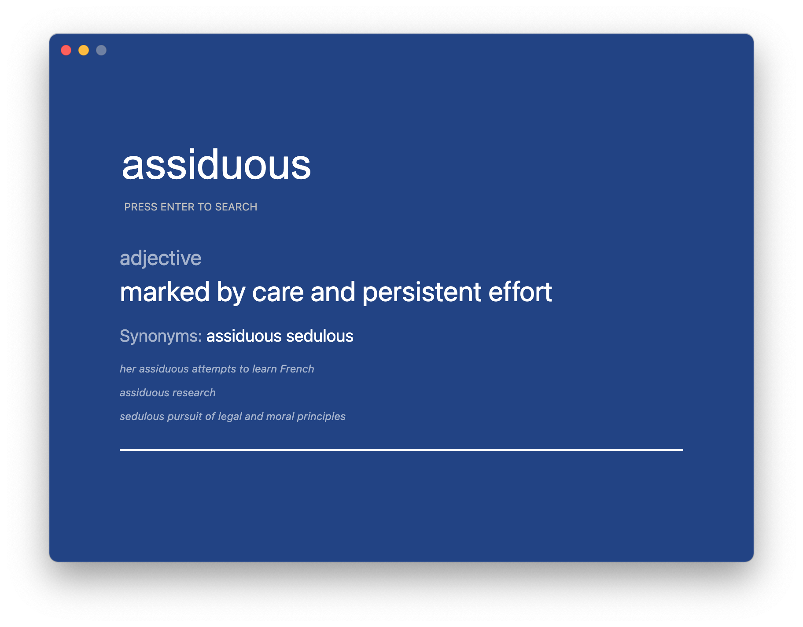

# Dictionary

Offline Desktop Dictionary Application Built Using Electron. Utilises Princeton Wordnet Database.

## Screenshot:

## Current Stats:

- **Status**: Under Development
- **Version**: 0.1.0 Beta
- **Releases**: N/A

## Platforms:

